# LAB-38-SSTP
Tanggal 20 agustus 2025

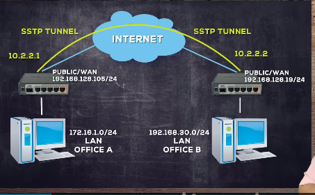 

# SSTP (Secure Socket Tunneling Protocol),
  SSTP merupakan sebuah PPP TUnnel dengan TLS 1.0 Channel. Fitur ini berjalan pada protokol TCP dan Port 443. Supaya dapat memanfaatkan SSTP secara optimal dengan keamanan yang baik, kita diharuskan menambahkan sertifikat SSL untuk koneksi antara server dan client. Kita bisa mendapatkan sertifikat SSL itu dengan membeli di vendor-vendor yang ada atau kita bisa membuat sertifikat sersebut mengunakan OpenSSL. Mikrotik juga sudah menambahkan fitur untuk membuat sertifikat SSL mulai dari RouterOS versi 6.xx dan bisa juga diterapkan ke perangkat non-Mikrotik.  
  
# Konfigurasi SSTP 
1. Lakukan dulu basic config sampai Mikrotik terkoneksi ke internet.

  

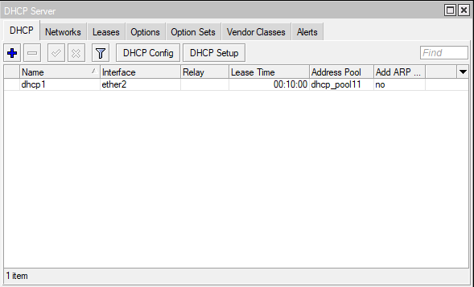  

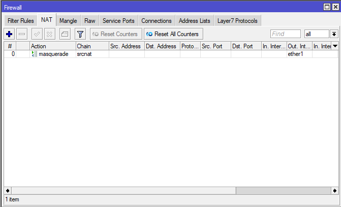  
  
2. Lalu masuk ke **PPP > Interface > SSTP server**, enable, lalu ubah Default profile nya ke **default-encryiption**, jika sudah APPLY lalu OK.  

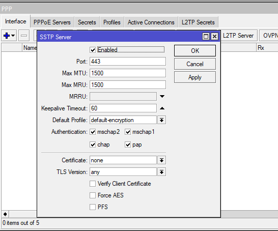  

3. Setelah itu, kita perlu membuat akun di secret **PPP > Secret > add**

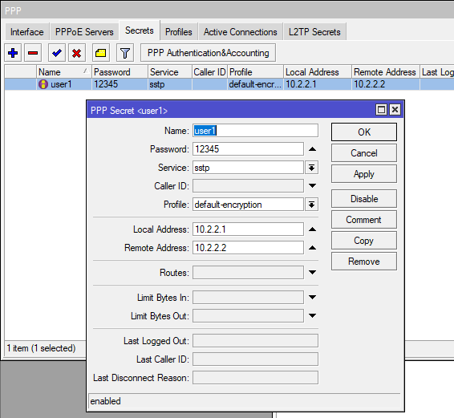  

4. Simple nya untuk konfigurasi SSTP server sampai sini sudah cukup.  
5. Jika client sudah dikonfigurasi, kita bisa cek melalui tab **active connections**, ada Address baru juga.  

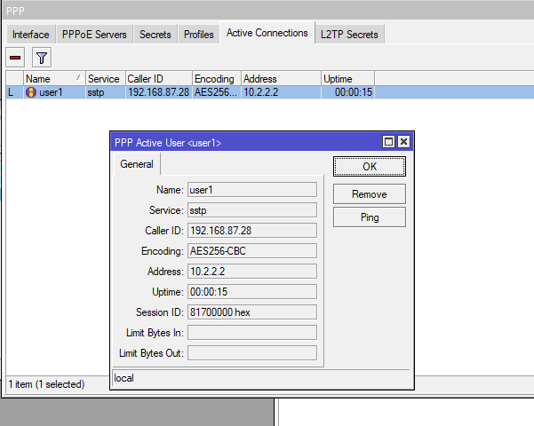  

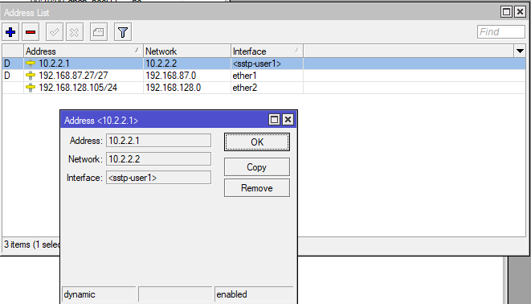  

6. Untuk mengkoneksikan LAN pada 2 site, maka kita harus membuat static routing, terdapat terletak di **IP > ROUTING**.  

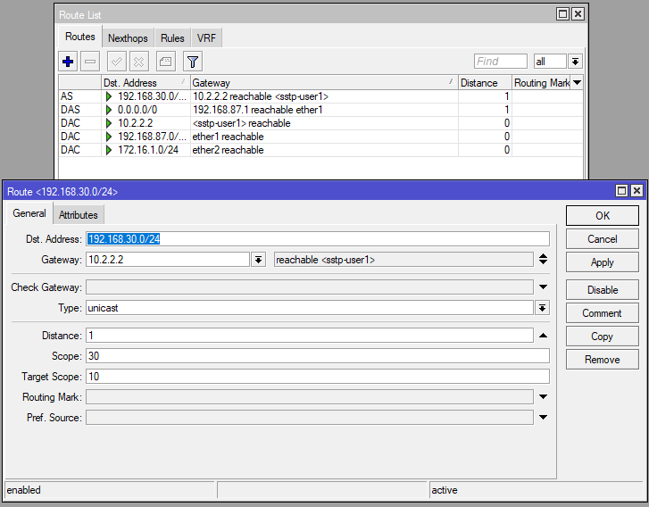  

7. Sekarang kita cek koneksi dengan melakukan **ping** pada terminal.

   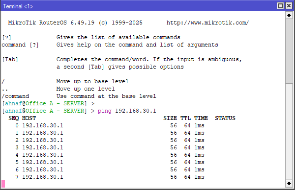  

# Konfigurasi SSTP certificate server
1. Sekarang kita buat sertifikat, di **system > certificate > add**, ada 3 sertifikat yang harus kita buat, untuk yang CA di bagian common name kita isi dengan IP Public router kita.  

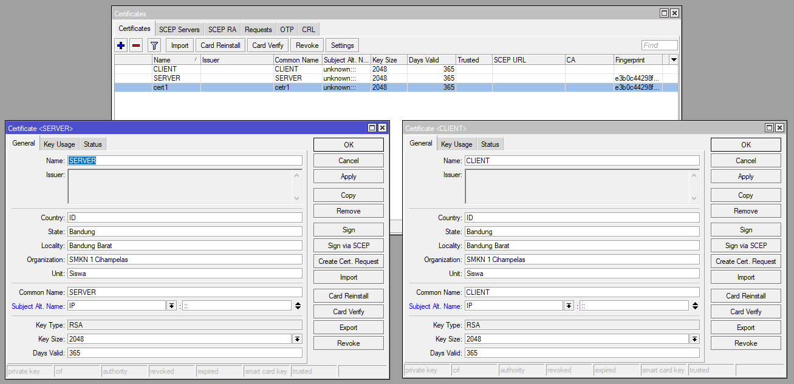
  
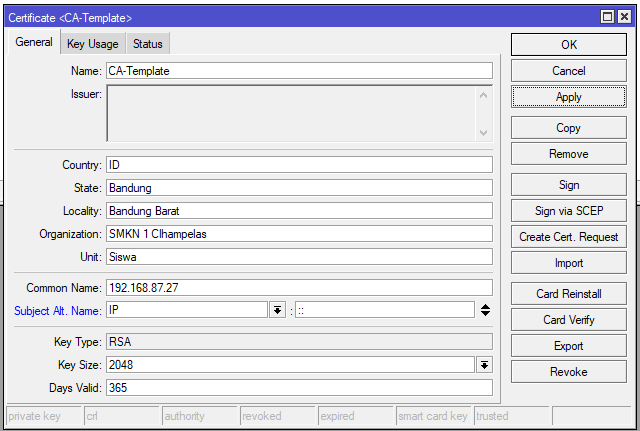  

2. Sekarang kita harus self sign in, di terminal karna di mikrotik belum ada GUI nya. Kita coba daftarkan dulu yang CA-Template.  

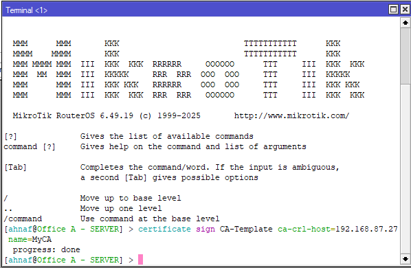  

3. Jika sudah selesai, kita bisa lihat ada flag KLAT di GUI sertificate, K=Private Key, L=crl, A= Authority, T=Trusted. Setelah ini barulah kita bisa melakukan proses self sign in untuk server dan client kita.

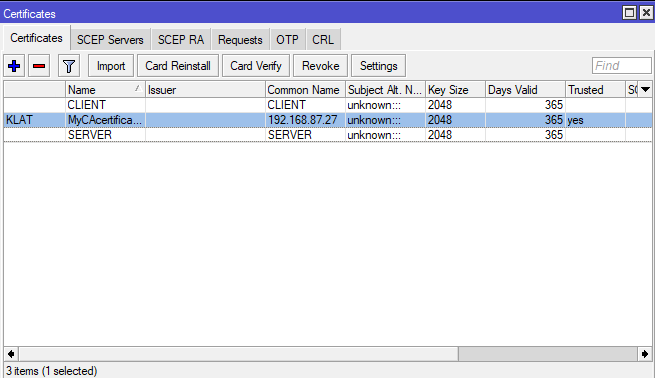

  

4. Sekarang buat agar client dan server dapat flag Trusted.

  
  
5. Jika sudah, baru sekarang kita dapat mengunakannya di SSTP. Sekarang kita dapat export sertifikat untuk di import ke client. 

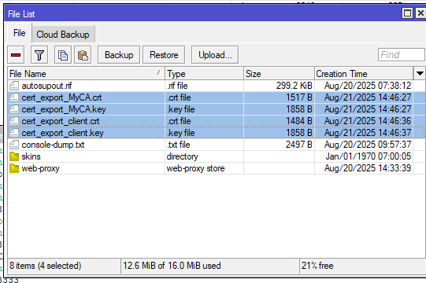  
  
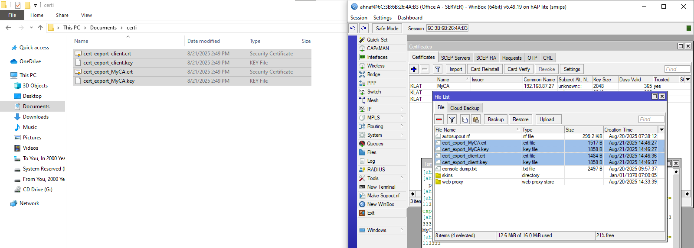  

6. Sekarang pindahkan file ke windows dan import ke router B.

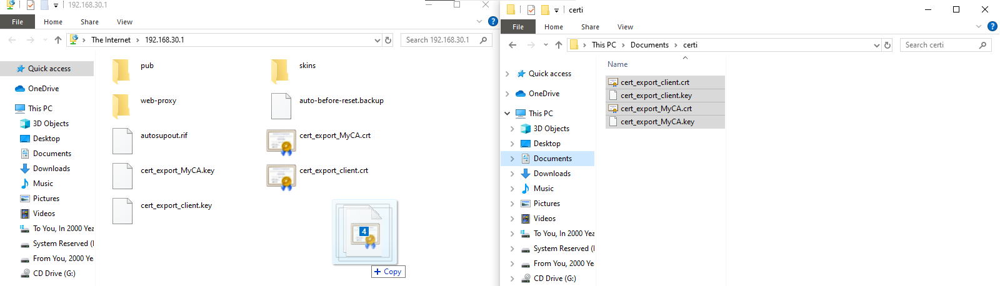

7. Lanjut set sertifikatnya di PPTP Server
  

8. Bisa kita lihat, bahwa jika sudah mengunakan sertifikat, encodingnya berubah, yang tadinya mengunakan AE256, sekarang menjadi RC4.

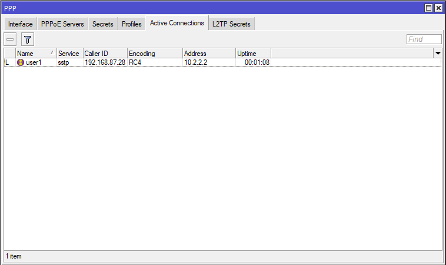  

**Encoding**
RC4, Lebih simple dan lebih baik dari segi kecepatan  
AES256, Lebih bagus dari segi keamanan  

# konfigurasi SSTP client 
1. masuk ke winbox
2. lalukan konfigurasi dasar untuk terhubung ke internet
3. pilih menu ppp > interface
4. klik (+)
5. isi nama(opsional)

6. di bagian tab Dial out bagian connet to isi dengan ip lan office A non aktifkan verify server address from certificate masukkan user dan password yang telah di buat oleh office A

7. bisa dilihat ada tangget R yang artinya sudah ter koneksi

8. kita mendapatkan ip address secara otomatis dari office A dan intercae baru        
   lihat di menu ip > address   

9. lalu kita buat route di        
   ip > routes  

10. setelah itu kita coba ping ke office  A di terminal    

# konfigurasi SSTP client certificate
1. pertama kita harus masukkan certificate yang telah di buat oleh server  
2. buka menu system > certificates > di tab **certificates** pilih menu import lalu masukkan certificate tadi yang file **crt** dan  **key**

3. ubah nama nya klo sekiranya terlalu panjang klik 2kli bagian nama    

4. lalu buka lagi menu ppp > interface buka **sstp-pusat** lalu di bagian **dial out** masukkan sertificate client tadi di bagian **certificate** lalu jangan lupa centang juga lalu klik **ok** 

# kesimpulan 
SSTP adalah protokol VPN yang menggunakan enkripsi SSL/TLS (port 443) untuk membuat koneksi aman antara client dan server.
