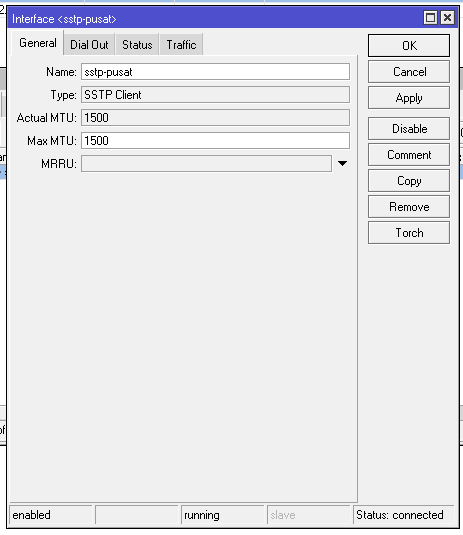
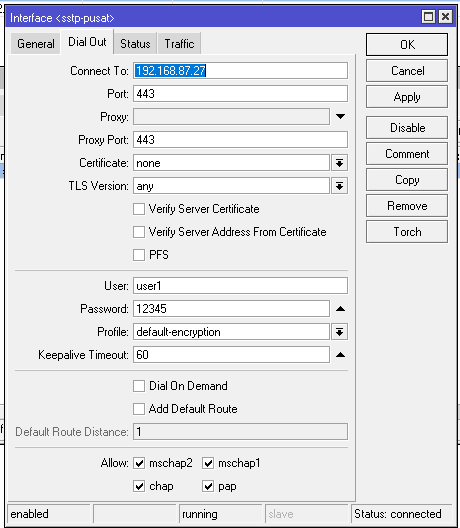
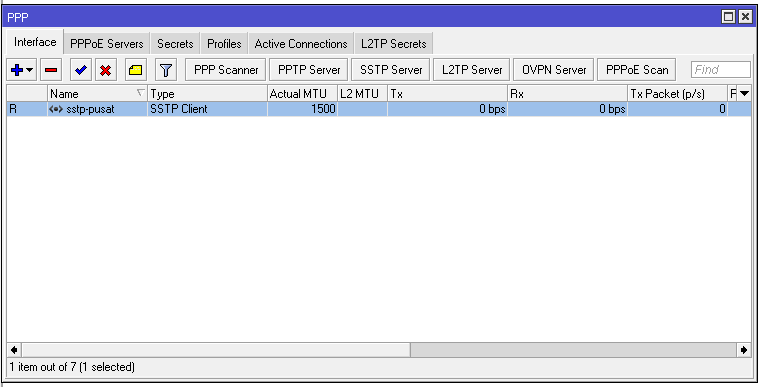
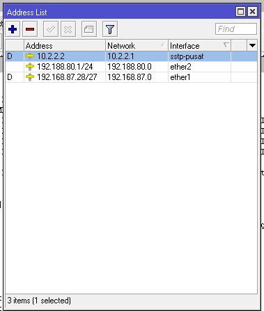
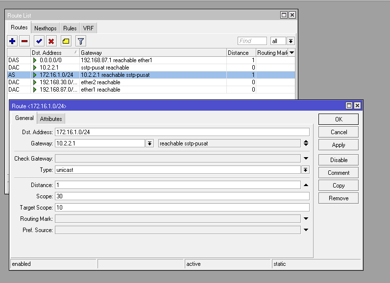
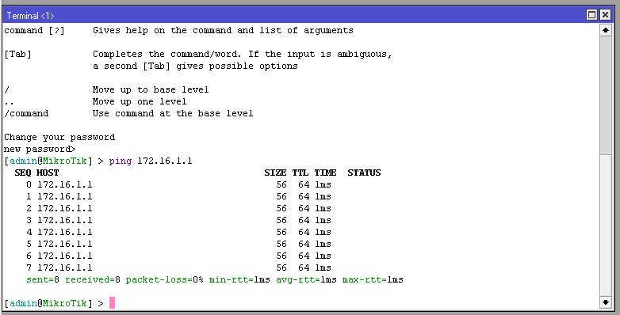
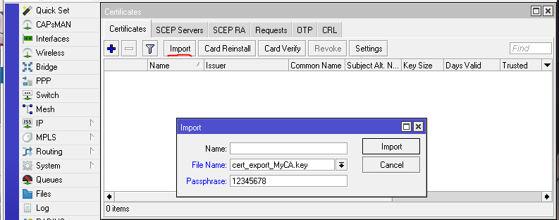
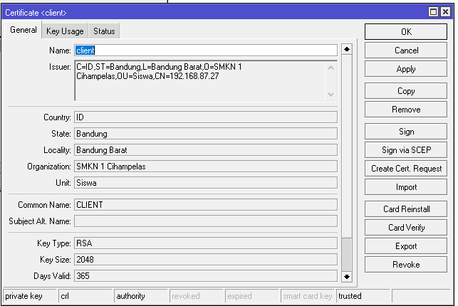
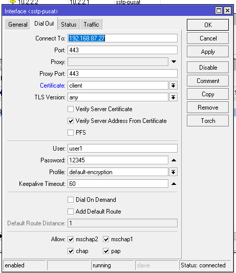

# LAB-38-SSTP
Tanggal 20 agustus 2025
# SSTP (Secure Socket Tunneling Protocol),

# konfigurasi SSTP client 
1. masuk ke winbox
2. lalukan konfigurasi dasar untuk terhubung ke internet
3. pilih menu ppp > interface
4. klik (+)
5. isi nama(opsional)

6. di bagian tab Dial out bagian connet to isi dengan ip lan office A non aktifkan verify server address from certificate masukkan user dan password yang telah di buat oleh office A

7. bisa dilihat ada tangget R yang artinya sudah ter koneksi

8. kita mendapatkan ip address secara otomatis dari office A dan intercae baru        
   lihat di menu ip > address   

9. lalu kita buat route di        
   ip > routes  

10. setelah itu kita coba ping ke office  A di terminal    

# konfigurasi SSTP client certificate
1. pertama kita harus masukkan certificate yang telah di buat oleh server  
2. buka menu system > certificates > di tab **certificates** pilih menu import lalu masukkan certificate tadi yang file **crt** dan  **key**

3. ubah nama nya klo sekiranya terlalu panjang klik 2kli bagian nama    

4. lalu buka lagi menu ppp > interface buka **sstp-pusat** lalu di bagian **dial out** masukkan sertificate client tadi di bagian **certificate** lalu jangan lupa centang juga lalu klik **ok** 

# kesimpulan 
SSTP adalah protokol VPN yang menggunakan enkripsi SSL/TLS (port 443) untuk membuat koneksi aman antara client dan server.
